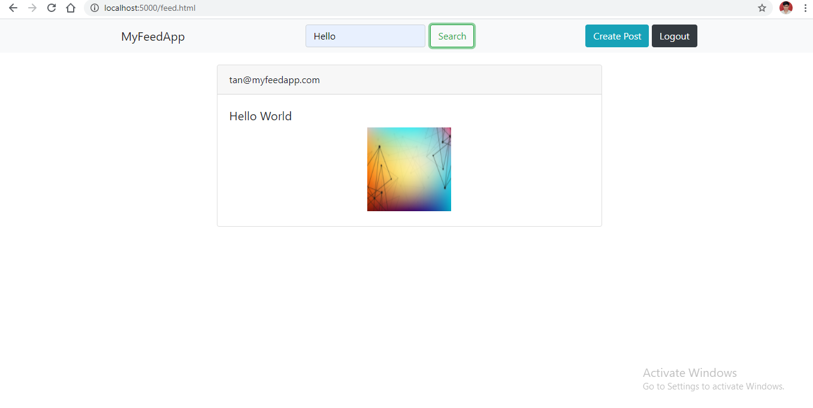

# Database Tables

 

# Login Page

# MyFeeds Page

# Create Post Page

# Search Posts 

 

# Regarding Database Connection
Data base used is Postgres
in db.js in password field database password need to be put in.

